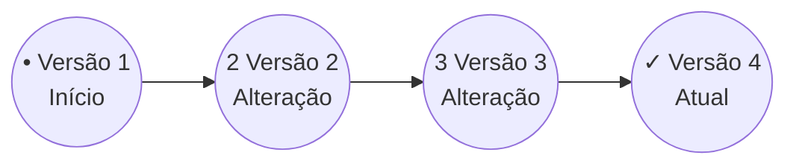

# 🌱 Aula 1 · Fundamentos

## O que é versionamento e por que usar Git

Antes de qualquer comando, vamos entender a ideia por trás do controle de versões — a base de tudo o que faremos no curso.

### 🎯 Objetivos da Aula

1. Entender o que é versionamento de código.
2. Reconhecer os problemas de trabalhar sem controle de versão.
3. Compreender por que o Git foi criado.
4. Identificar os principais benefícios do Git em projetos de software.

---

## 💥 O Problema: Você já criou um "ProjetoFinalAgoraVai"?

Sem uma forma organizada de controlar mudanças, todo projeto vira uma pilha de cópias — e ninguém lembra mais qual é a versão certa.

### O Caos dos Arquivos:

* 📄 Projeto.docx
* 📄 ProjetoFinal.docx
* 📄 ProjetoFinal2.docx
* 📄 ProjetoFinalAtualizado.docx
* 🤯 **ProjetoFinalAgoraVai.docx**

> 🔑 **Chave:** Versionamento é a forma de **registrar e organizar a evolução** de um projeto ao longo do tempo.

---

## 📚 De cópias soltas a um histórico único

| Cenário | Fluxo de Arquivos | Experiência |
| :--- | :--- | :--- |
| **❌ Sem Versionamento** | `Trabalho.docx` `TrabalhoFinal.docx` `TrabalhoFinal2.docx` `TrabalhoFinalAgoraVai.docx` | Vários arquivos acumulados na pasta, nenhuma clareza de qual é o correto. |
| **✅ Com Versionamento** | Versão 1 ➜ Versão 2 ➜ Versão 3 ➜ Versão 4 | Um único arquivo visível, com todo o histórico guardado pelo sistema. |

> 🔑 **Chave:** Versionar **não** é criar várias cópias de um arquivo — é **registrar sua evolução**.

---

## 🕒 Uma linha do tempo do projeto

Em vez de criar arquivos novos, o sistema guarda cada mudança em um único histórico ordenado.

> 🔑 **Chave:** Cada mudança fica registrada — dá para **voltar no tempo** sempre que precisar.

---

## 🐙 Quem faz esse controle? O Git.

O Git é a ferramenta que registra as alterações de forma rápida, segura e organizada. Com ele você consegue:

* 💾 **Registrar:** Salva cada alteração feita no projeto.
* ⏪ **Voltar:** Retorna a versões anteriores sem medo.
* 🔍 **Comparar:** Mostra exatamente o que mudou.
* 🙋‍♀️ **Identificar:** Registra quem fez cada alteração.
* 🤝 **Colaborar:** Várias pessoas no mesmo projeto sem sobrescrever.

> 🔑 **Chave:** O Git registra **toda a história do seu projeto**.

---

## 🌍 Um padrão da indústria de software

De projetos pessoais a plataformas usadas por milhões de pessoas — mesmo trabalhando sozinha, usar Git é considerado uma boa prática.

* 👩‍💻 Projetos pessoais
* 🚀 Startups
* 🏢 Empresas de tecnologia
* 🌐 Projetos open source
* 🏛️ Grandes organizações

> 🔑 **Chave:** Aprender Git é uma **habilidade essencial** para qualquer pessoa que desenvolve.

---

## ✨ Três dicas para começar bem

* **🧍‍♀️ Não espere trabalhar em equipe:** Mesmo projetos simples se beneficiam do versionamento desde o primeiro dia.
* **⏱️ Use o Git desde o início:** Assim todo o histórico do projeto fica registrado, sem lacunas.
* **🧪 Não tenha medo de experimentar:** Uma das maiores vantagens é poder voltar atrás caso algo não funcione.

---

## 🎯 Prática guiada & Checklist

Nesta aula ainda não usamos comandos — o objetivo é fixar as ideias.

### Checklist de Aprendizado

* [x] Entendi o conceito de versionamento.
* [x] Identifico os problemas de trabalhar sem histórico.
* [x] Sei para que serve o Git.
* [x] Reconheço os benefícios do controle de versão.

### 💬 Perguntas para a turma:

* ❔ Você já perdeu uma versão importante de um arquivo?
* ❔ Já precisou desfazer uma alteração?
* ❔ Já trabalhou em um documento junto com outra pessoa?

---

## 🏁 O que levamos desta aula

Hoje entendemos o que é versionamento e por que o Git é tão importante no desenvolvimento de software.

> 💡 **Você sabia?**
> O Git foi criado para ser extremamente rápido e eficiente. Mesmo projetos com milhares de arquivos registram novas versões em poucos segundos — por isso ele se tornou a ferramenta de controle de versão mais usada no mundo.

➡️ **Próxima aula:** Vamos **instalar o Git** no computador e fazer a configuração inicial.